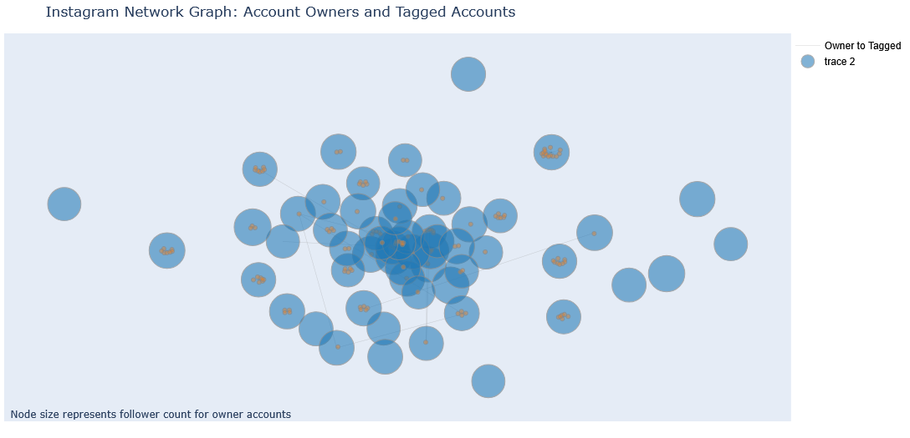

# Social Media Influence Network

## Project Overview
This project aims to develop two social media tools to aid in social media marketing. The first tool involves building a network graph to identify influential users, communities, and viral content. The second tool focuses on creating a content virality predictor.

## Part 1. Network Graph

To build a network graph that helps users identify influential users, communities, and viral content, we need relevant data to derive these insights. One straightforward method for identifying influential users is by assessing their reach, which can be observed in a network graph through the number of connections a user has. Communities can be identified by proximity or how closely related nodes are to each other. Depending on the data gathered, clustering algorithms can be used to identify different communities and groups within the network. Viral content can potentially be identified by observing whether it is relevant to clusters of influential users or communities.

Data required for network graph
1. Reach: Follower/following relationship
2. Account proximity: user traits/characteristics e.g. (common language, geography, time zone, etc.)
3. Hashtags: to identify content clusters among users

### Data Collection

Initially, I attempted to build a web scraper to collect social media data. However, I encountered challenges as social media platforms employ security measures like CAPTCHAs to prevent automated access and data scraping. I then shifted to using datasets already scraped by others and uploaded to Kaggle for public use. Unfortunately, most of these datasets were not relevant to our use case and were often outdated. I discovered a useful tool called [gallery-dl](https://github.com/mikf/gallery-dl), which can scrape data from Instagram without being blocked. By combining data scraped from Wikipedia and this tool, I was able to scrape the most recent five posts from the  [top 50 instagram accounts](https://en.wikipedia.org/wiki/List_of_most-followed_Instagram_accounts).

Unfortunately, since this scraper tool is primarily for content scraping, I could only scrape content posted by an account and very limited user metadata. I was unable to gather data on an account's following and follower information. If I had more time, I would have forked the scraper to add account metadata scraping or found other tools that could gather account information. Despite this limitation, I was still able to build a network graph showing the connections between the top 50 Instagram accounts and other users they tagged in their posts.

### Network Graph Analysis

Here is the network graph generated from the data. Some basic insights from this graph include that major influencers mostly tag people within their own circle. From the few connections (edges) we can see between influencers, there are obvious connections. For example, there is a tagging connection between Kim and Khloe Kardashian. Given the limited data we were able to gather, there are not many additional insights we can derive.

### Production
The first step in scaling this for production is to create a scheduled job that scrapes new data daily and appends it to a data store. Next, I would build an online tool that allows users to interact with the network graph in real-time and be able to select what kind of information they want to view. We can even introduce a temporal aspect to the network graph, enabling users to look back in history to see dynamic changes in the network over time. I only scraped data from Instagram for this project, but in production, the same pipeline should be built for each social media platform. 

## Part 2. Content Virality Predictor

The goal is to build a virality predictor for social media content. We need to develop a model or system of models that can predict whether a post will become viral before it actually does. This can be a tool used to evaluate marketing campaigns and help select potentially viral content for release.

### Success (Viral) Criteria

The first step in building this system is establishing the criteria and qualities of a viral post. Below are a few examples, but the exact criteria can be tweaked and optimized based on the client's priorities.

The standard engagement metrics are the simplest way to start measuring whether a post is viral. Once this is established, we can add time to the equation and require virality to be determined by high engagement over a short period.
- Views
- Likes
- Comments
- Shares

### Data Collection
From the data I gathered to build the network graph, I also scraped the actual images from top influencers. To transform the image data into usable features, I used ResNet50, a trained deep neural network for image classification, and utilized all but the last layer to generate embeddings for the images. In addition to these embeddings, I scraped post metadata that includes captions, likes, and other information. I used BERT, a language model, to generate text embeddings for the captions. Combining all these, I have the training data to train a content virality predictor given an image and its caption.

### Production
I envision influencers working with the company uploading their planned content to a centralized platform for review. This model can serve as a tool integrated into that platform, scoring each planned post for its potential virality. The next step would be to build a complete feedback loop that monitors and gathers data from launched content, using it as feedback to fine-tune the model. Additionally, we can incorporate parameters into the model to allow for adjustments in behavior and prediction based on the marketing campaign goals.